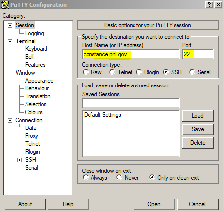
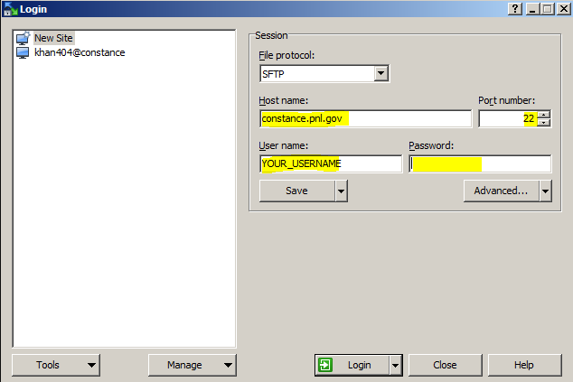
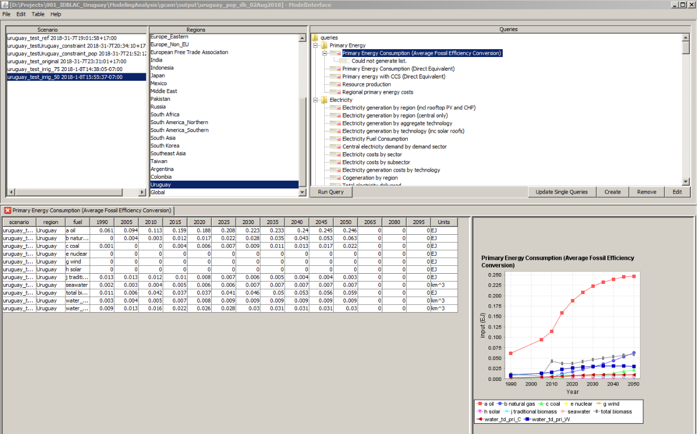

```{r setup, include=FALSE}
knitr::opts_chunk$set(echo = TRUE)
options(knitr.table.format = "html")
```

# Introduction

- This guide does not replace the more detailed documents and links provided below. It is meant to summarize some of the key issues for visitors when they come and first set up GCAM.
- For any updates or corrections to this guide please contact zarrar.khan@pnnl.gov
- For github documents go to https://github.com/zarrarkhan/rJGCRI_GCAMGuide  


# Helpful Links and Resources

- **GCAM:**
    + Installing GCAM on PIC (confluence access required): https://confluence.pnnl.gov/confluence/display/JGCRI/Setting+up+GCAM+on+PIC
    + GCAM User Documentation : http://jgcri.github.io/gcam-doc/
    + GCAM Documentation TOC: http://jgcri.github.io/gcam-doc/toc.html
    + Model Overview http://jgcri.github.io/gcam-doc/overview.html
    + GCAM User Guide: http://jgcri.github.io/gcam-doc/user-guide.html
    + Tutorials:
        - 2017 Tutorial Slides: http://www.globalchange.umd.edu/data/annual-meetings/2017/GCAM_Tutorial_2017.pdf
        - Lecture 3: Intro to GCAM: https://www.youtube.com/watch?v=xRF9lFwtMr0
        - Lecture 4: GCAm Tutorial: https://www.youtube.com/watch?v=S7vAShH-dbs
- **Tethys:** https://github.com/JGCRI/tethys
- **Xanthos:** https://github.com/JGCRI/xanthos
- **Demeter:** https://github.com/immm-sfa/demeter

# Key Software & Terms

- **PIC:** PIC (PNNL Institutional Computing) is the PNNL supercomputer: https://confluence.pnnl.gov/confluence/display/PICHELP/PIC+Help+Home
- **PuTTY:** PuTTY is the SSH client used to securely access PIC: 	https://www.chiark.greenend.org.uk/~sgtatham/putty/
- **WinSCP:** WinSCP is a file managing software to easily manage files between your PIC account and your local desktop:	https://winscp.net/eng/download.php


# Accounts and Access
- **PIC Issues:** Contact PNNL Computing Help: pic-support@pnnl.gov
- **Complete Training:** 
    - Need to complete training to receive username for PIC	
    - You will receive an email from administration with a link to http://elearner.pnnl.gov
    - In the email you will have a temporary UN and PW
- **Receive PIC Username:** 
    - A PNNL host will request a PIC account for you at https://iops.pnl.gov/iops/mainmenu.html?c_role=default
    - An email will be sent from a PNNL administrator to you confirming your new account and username
- **Create SecureID PIN:**
    - When you arrive you will have received a SecureID token generator. This is a physical device like a USB stick which displays a 6 digit token. This token continuously changes and will become part of your new PW. You will use the secure token to generate a new SecureID PIN
        - Go to https://portal.pnnl.gov
        - Enter your username and in the SecureID Field enter the SecureID token from your token generator. Leave the PW field blank.
        - You will be put into a PIN setting screen, where you enter your choice of PIN twice. PINs must be 6 digits
        - Once your PIN is set, the system will ask for PASSCODE. This PASSCODE will be your PIN followed by the new six digits from the token (which constantly change). For example, if the PIN is xxxxx and 6 digits from token are 123456, the PASSCODE is xxxxx123456.
- **Login to PIC:**
    - Now you can login to PIC by opening PuTTY and entering the correct connection settings with your UN and PW.	
    - Open PuTTY and do the following:
        - In "Host Name (or IP address)" enter "constance.pnl.gov"
        - In "Port" enter "22"
        - Leave everything else as is and click "Open"
        - A command prompt will open and ask for login. Enter your username fro PIC
        - Then enter your PASSCODE as created in the step above.
        


- **Login to WinSCP:**
    - Now you can login to WinSCP and connect to your folder on PIC.
    - After you login you will be able to view folders on your desktop on the left and your folder on the PIC supercomputer on the right.
    - Open WinSCP and do the following:
        - In "Host name" enter "constance.pnl.gov"
        - In "Port number" enter "22"
        - In "User name" enter your username
        - In "Password" enter your PASSCODE
        


- **Access to GCAM folder:** 
    - You may need access to the GCAM folder on PIC which has all the libraries and files to install.	
    - Email pic-support@pnnl.gov to ask for access to the pic/projects/GCAM folder.

- **Remote access:**
    - In case remote access is needed users will need to setup a virtual private network.	
    - Go to https://remote.pnl.gov to download the Cisco Anyconnect client
    - vpn should be set to: remote.pnl.gov
    - You can login with your US and Passcode
    
    
# Installing GCAM on PIC
- **Access GCAM Folder**: Make sure you have access to the GCAM folder on pic which has the libraries by emailing pic-support@pnnl.gov and asking for access.
- **Confluence Guide:** https://confluence.pnnl.gov/confluence/display/JGCRI/Setting+up+GCAM+on+PIC
- Login to PIC from PuTTY
- Load Modules (Note: these may need to be updated with new versions of GCAM)
```{r, echo=T,cache=F, eval=F,message=F}
module load git
module load svn/1.8.13
module load R/3.2.0
module load java/1.8.0_31
module load gcc/5.2.0
```
- Clone the core model version from stash
```{r, echo=T,cache=F, eval=F,message=F}
git clone https://stash.pnnl.gov/scm/jgcri/gcam-core.git
```    
- Enter the GCAM WorkSpace:
```{r, echo=T,cache=F, eval=F,message=F}
cd ./gcam-core
``` 
- On the stash page check the version of GCAM that you want to work with. Ask the PNNL team member you are working with about which branch to use. Checkout the branch:
```{r, echo=T,cache=F, eval=F,message=F}
git checkout ENTER_BRANCH_NAME_HERE
``` 
- Load Hector
```{r, echo=T,cache=F, eval=F,message=F}
git submodule init ./cvs/objects/climate/source/hector
git submodule update ./cvs/objects/climate/source/hector
``` 
- Build GCAM (Need to Load Modules again)
```{r, echo=T,cache=F, eval=F,message=F}
module load git
module load svn/1.8.13
module load R/3.2.0
module load java/1.8.0_31
module load gcc/5.2.0
make gcam -j 12
```
- Note: You need access to GCAM libraries as stated earlier otherwise you will get an error.
- After GCAm is built you should get a message which says "BUILD COMPLETED" and a date
- Go to the exe folder and check that the date is the same as the build command output
```{r, echo=T,cache=F, eval=F,message=F}
cd ./exe
ls -l gcam.exe
```
- Build Data System
    - Open WinSCP and connect to PIC using username and PASSCODE
    - In gcam-core/input/gcam-data-system/energy-data/level0 need to add "en_nonOECD.sv" and "en_OECD.csv". If you don't have these files you will need to get these from a staff member at PNNL-JGCRI
    - In PuTTY:
```{r, echo=T,cache=F, eval=F,message=F}
cd ../ # In order to leave the exe folder from above and go to the gcam-core folder
cd ./input/gcam-data-system
module load R/3.3.3
# Make sure the "en_nonOECD.csv" and "en_OECD.csv" are copied into the folder before running make
make clean
make
```
# Run GCAM on PIC
- **Key Files:** In gcam-core/exe you will edit the following key files:
    - gcam.zsh
    - configuration.xml (can have another name eg. conifugration_ref.xml)
    - batch.xml (can have other names)
- **gcam.zsh:**This file is in BASH and calls the configuration file. It will not be in your cloned version and you need to create or copy it. See the instructions in the "Installing GCAM on PIC". Within this file will be a line "-Cconfig-$job.xml". This line means the configuration file needs to be named config-NAME.xml where NAME is whatever you choose to name your configuration file.The gcam.zsh file includes the following lines of code (more details are explained in the Installing GCAM on PIC guide):
Note: You will need the correct account name to run a GCAM run on PIC. This will be provided by the scientists working in your project.
```{bash, echo=T,cache=F, eval=F,message=F}
#!/bin/zsh
#SBATCH -A ACCOUNTNAME
#SBATCH -t 90
#SBATCH -N 1
job=$SLURM_JOB_NAME
echo 'Library config:'
ldd ./gcam.exe
date
time ./gcam.exe -Cconfig-$job.xml -Llog_conf.xml
date
```
- **configuration.xml:** This will be named by the user and have a format based on how it was defined in the gcam.zsh as explained above. For example it could be config-ref.xml. Within this file a few key items are usually edited. key items to edit (Will need to search for these):
    - <Value name="BatchFileName">batch.xml</Value> (Make sure batch.xml is the same name as your batch file)
    - <Value name="scenarioName">Reference</Value> (The Name of your reference scenario)
    - <Value name="BatchMode">1</Value> (Make sure this is 1 if a batch file is included)
    - <Value name="stop-period">-1</Value> (Leave -1 if want to run for all periods otherwise period 0 is upto 1975, 1 is upto 1990, 2 upto 2005, 3 upto 2010, 4 upto 2015 and so on in increments of 5 years per period. Setting this to 11 will stop the model in and including the year 2050.
- **batch.xml:** This file is used to run combination of multiple scenarios. In this file we include various "add-on" xml files which then replace existing data. This file may also not be in the cloned version and will need to be created or copied.It should also be place in the exe folder. 
    - In this batch file we have "ComponentSet" and the "FileSet". The component sets can be thought of as broader themes and the files within each component are different scenarios to be explored. Each element or "FileSet" within each component will be combined with elements from all other components. So in the example above the model will run GasRef+Theme2Ref, GasRef+Theme2Changes, GasHi+Theme2Ref and GasHi+Theme2Changes. The file set names are appended together.
    - Within each file set we include the "add-on" xml files which overwrite existing data inputs. These can be new population projects, carbon policies or caps, changes in technology prices or changing the shareweights of technologies like nuclear or coal for example. These changes are discuss in a separate section below.
        - The following syntax is used:
```{r, echo=T,cache=F, eval=F,message=F}
<!-- To comment out code -->

<BatchRunner xmlns:xsi="http://www.w3.org/2001/XMLSchema-instance" xsi:noNamespaceSchemaLocation="batch_runner.xsd">

<ComponentSet name="Gas">
    <FileSet name="GasRef">
    </FileSet>
    <FileSet name="GasHi">
        <Value name = "x">../input/policy/YOURPOLICY.xml</Value>
    </FileSet>
</ComponentSet>
 
 
<ComponentSet name="Theme2">
    <FileSet name="Theme2Ref">
    </FileSet>
    <FileSet name="Theme2Changes">
        <Value name = "x">../input/policy/YOURPOLICYTHEME2.xml</Value>
    </FileSet>
</ComponentSet>
 
</BatchRunner>
```

- **Run Model:** In PuTTY go to your gcam-core/exe folder and then type the following commands. After your run has been submitted the status will show "PD" for pending and "R" for running. After the run has been completed you can check the exe folder for a file named "slurmXXX" where XXX is the JOBID. This is a log of the model run. You can also see the complete log in "master.log".
```{r, echo=T,cache=F, eval=F,message=F}
cd ./exe
sbatch -J config-ref run-gcam.zsh  # Where "config-ref" is the configuration file.
squeue -u USERNAME # to check the status of your run
# scancel JOBID  # This can be used to cancel a job which is in progress
# After run check "slurmXXX" where XX is JOBID or "master.log" in the exe folder for model run stats.
```


# Model Interface (Viewing Data)
- Once GCAM has run it will output all its data into a database to the gcam-core/output folder. The name of the database by default is database_basexdb but this can be changed in the configuration file described above.
- For viewing the data there is a tool called "Model Interface" which is found in any of the release versions of GCAM. This can be downloaded from the github page https://github.com/JGCRI/gcam-core/releases. The "Model Interface" can be found in gcam-core/ModelInterface. Follow the instruction on the github page to install the release version. It may need additional installations of java, XML Maker and R.
- Use WinSCP to drag the output database from your PIC output folder to a local folder on your computer. You will view the data offline locally on your computer.
- The "Model Interface" read in different queries which are based on a query file which is an .xml file.
- This query file is defined in gcam-core/ModelInterface in the "model_interface.properties"
- The Main_queries file lying in "gcam-core/output/queries" can be modified to get relevant queries for the analysis.
- Inside gcam-core/ModelInterface:
    - click on "run-model-interface.bat"
    - Click File>Open>DB Open and then point to the output database that you copied from PIC into your local drive.
    - This will open the ModelInterface and it will show you all the scenarios you ran from your batch.xml, the different regions and a list of queries as shown below.
    - To edit the query file being read open the "model_interface.properties" file and change the line which says: "<entry key="queryFile">..\output\queries\Main_queries.xml</entry>"
    


# Prepare Add-on Scenario
- In the batch file in each "FileSet" we can add the path to an ".xml" file which basically overwrites the existing data with new data.
- The "add-on" .xml files are usually kept in gcam-core/input/policy. You will need to find out which .xml file needs to be changed to create the new policy depending on what you are trying to achieve. This is explained further in the section below.
- Two ways to create these are:
    1. Make a copy of a known xml file that you want to change and then edit this by opening it in XML maker.
    2. Using Level 2 data:
        - Find out which data file needs to be changed. For example for not allowing any new nuclear technology to be installed in the system you can change the sahreweight of nuclear to 0 for the years that you want. This is changed in the file L223.SubsectorShrwt_nuc which is lying in gcam-core/input/energy-data/level2/.
        - Make a copy of this csv file in the gcam-core/input/policy folder and append an appropriate name.
        - Edit the csv by removing all the data that is not relevant and changing the values for the year, region and technology that is relevant to your case.
        - Then open Model Interface and open the modified .csv file.
        - Model Interface will ask for a header file. Point it to: "gcam-core\input\gcam-data-system\_common\headers\ModelInterface_headers.txt"
        - Save the file as an .xml.
        - The path to this file can now be added in your bacth.xml as part of your scenario "FileSet".
        
# Key Files to Edit for Scenarios

```{r, echo=F,results='asis',message=F}
library(kableExtra)
text_tbl <- data.frame(
  Theme = c("Population", "Energy Technology Mix", "Irrigation Expansion", "Agricultural Production", "NDCs and Emissions"),
  Description = c(
    " - Change the level 2 gSSP2 data",
    " - After the base year has been calibrated, investments in new technologies are based on a logit function which has a shareweight. By changing the shareweight for a particular technology we can control how much of that technology is invested in future years. By making the shareweight '0' none of the technology will be invested in while increasing the shareweight means more will be installed.",
    "","",""),
Files = c("1. \\\\input\\\\gcam-data-system\\\\socioeconomics-data\\\\level2\\\\L201.Pop_gSSP2.csv", 
"1. \\\\input\\\\gcam-data-system\\\\energy-data\\\\level2\\\\L223.SubsectorShrwt_nuc
2. \\\\input\\\\gcam-data-system\\\\energy-data\\\\level2\\\\L223.SubsectorShrwt_coal",
"","","")
)

kable(text_tbl) %>%
  kable_styling(full_width = T, position ="center") %>%
  row_spec(0,align='c', background ='#E8E8E8') %>%
  column_spec(1, width = '10em',bold = F, border_right = T) %>%
  column_spec(2, width = "30em",border_right = T) %>%
  column_spec(3, width = "30em")
  
```

# Input Data Sources & Files


```{r, echo=F,results='asis'}
library(kableExtra)
text_tbl <- data.frame(
  Parameter = c("Population", "Energy Mix", "Primary Energy", "Final Energy", "Water Demands", "Water Withdrawals", "Water Consumption", "Agricultural Production"),
  Description = c(
    "",
    "",
    "","","","","",""),
Historical = c(
    "- Maddison (.\\\\input\\\\gcam-data-system\\\\socioeconomics-data\\\\level0\\\\Maddison_population.csv)
- UN",
    "",
    "","","","","",""),
Forecast = c(
    "- IIASA SSP",
    "",
    "","","","","","")
)

kable(text_tbl) %>%
  kable_styling(full_width = T, position ="center") %>%
  row_spec(0,align='c', background ='#E8E8E8') %>%
  column_spec(1, width = '10em',bold = F, border_right = T) %>%
  column_spec(2, width = "20em",border_right = T) %>%
  column_spec(3, width = "20em",border_right = T) %>%
  column_spec(4, width = "20em")
  
```