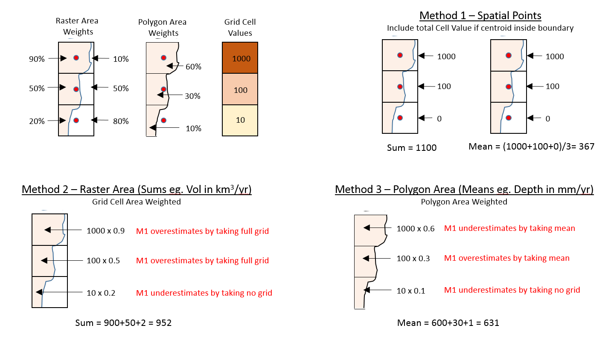

```{r setup, include=FALSE}
knitr::opts_chunk$set(echo = TRUE)
```

# Introduction

> For complete script go to https://github.com/zarrarkhan/rSpatialAggMethods  
> This summary does not show all code

Testing for three methods of spatial aggregation

1. Method 1 (m1): Spatial Points - Using Spatial Points Data Frames
2. Method 2 (m2): Raster Areas - Cropping a raster with a polygon using the raster area weights
3. Method 3 (m3): Polygon Areas - Cropping a polygon grid and using the subsequent polygon area weights

# Conceptual example of methods



**Conclusion:** 
* For volume (km^3^/yr) where need to sum use m2 which uses the grid cell weighted area
* For depth (mm/yr) where need to take mean use m3 which takes the grid cell value and weights it by the polygon area

```{r, echo=F,cache=T, message=F}
#-----------------
# Intial Setup
#-----------------

rm(list=ls()) # Clear all old variables
graphics.off() # Turn of Graphics

# Load Libraries
packagesX     <-c("ggplot2","RColorBrewer","reshape2","magrittr","plyr","dplyr","tools","scales","rgcam","rgdal","rgeos","raster","tmap","animation","tis","tibble","classInt","sp","geosphere","Hmisc","gridExtra","grid")
for(i in packagesX){if(i %in% rownames(installed.packages()) == FALSE){install.packages(i)}
                    library(i,character.only = TRUE)}

# Working Directories
wd0           <- getwd()

# ggplot2 Theme
z_theme <<- theme_bw() + 
  theme(
    text =                element_text(family = NULL, face = "plain",colour = "black", size = 24 ,hjust = 0.5, vjust = 0.5, angle = 0, lineheight = 0.9)
    , axis.text.x =       element_text(size=24)
    , axis.text.y =       element_text(size=24)
    ,axis.title.x =       element_text(vjust = -1, margin=margin(t=1,unit="line"))
    ,axis.title.y =       element_text(angle = 90, vjust = 2, margin=margin(r=1,unit="line"))
    ,legend.key =         element_blank()
    ,legend.key.size =    unit(1.5, 'lines')
    ,legend.text =        element_text(size = rel(1.0), colour = "black")
    ,legend.title =       element_text(size = rel(1.2), face = NULL, hjust = 0, colour = "black")
    ,strip.background =   element_rect(fill = NA, colour = "black")
    ,plot.margin =        unit(c(1, 1, 1, 1), "lines")
    ,plot.title=          element_text(face="bold", hjust=0,size=40,margin = margin(b=20))
  )

z_tmap<-tm_legend(outside = TRUE,title.size=2.5,text.size = 2,height=2,width=2)

```

# Read Data

Read in polygon and raster data. In this example we use spatial boundaries from the GADM dataset for the region Argentina and Tethys water demand gridded outputs. All raw files available in the github repository.

```{r, echo=F,cache=T, message=F, warning=F, results='hide',fig.width=15,fig.height=10}
#-----------------
# Read in Spaital Data
#-----------------

# Choose Region
region_i<-"Argentina" # Must be region in the GADM data

# Read in Spatial Data
gadm36L1 <- readOGR(paste(wd0,"/gadm",sep=""),"gadm36_1",use_iconv=T,encoding='UTF-8') # GADM data from https://gadm.org/
projX    <- proj4string(gadm36L1) # Set projections

# Crop Shapefile to selcted region
shpa1<-gadm36L1  
shpa1<-shpa1[shpa1$NAME_0==region_i,]
shpa1@data<-droplevels(shpa1@data);

# Create a larger Bounding Box for Display
expPrcnt<-2; # Expand by Percent
b1<-as.data.frame(bbox(shpa1))   # Get Bounding box
b1$min[1]<-if(b1$min[1]<0){(1+expPrcnt/100)*b1$min[1]}else{(1-expPrcnt/100)*b1$min[1]};
b1$min[2]<-if(b1$min[2]<0){(1+expPrcnt/100)*b1$min[2]}else{(1-expPrcnt/100)*b1$min[2]};
b1$max[1]<-if(b1$max[1]<0){(1-expPrcnt/100)*b1$max[1]}else{(1+expPrcnt/100)*b1$max[1]};
b1$max[2]<-if(b1$max[2]<0){(1-expPrcnt/100)*b1$max[2]}else{(1+expPrcnt/100)*b1$max[2]};
b1<-as(extent(as.vector(t(b1))), "SpatialPolygons")
proj4string(b1)<-CRS(projX) # ASSIGN COORDINATE SYSTEM

# Plot Selected Region
m1<-qtm(shpa1,text="NAME_1",fill="NAME_1")+tm_layout(legend.show=F,frame=F,title="Polygon Shapefile",title.size=2,title.position=c("right","top"))

#-----------------
# Read in Raster Data
#-----------------

# Read in Data Files (Tethys example file, Chosoe year X2005)
df<- read.csv(paste(getwd(),"/wdirr.csv",sep=""), stringsAsFactors = F)
colnames(df)[which(names(df) == "latitude")] <- "lat"
colnames(df)[which(names(df) == "longitude")] <- "lon"
df<-df%>%dplyr::select(X..ID,lat,lon,X2005)

# CREATE RASTER FILE FOR DATA
r<-df%>%dplyr::select(lat,lon,X2005)
coordinates(r)=~lon+lat
gridded(r)<-T
r<-raster(r)
projection(r)<-projX

rcrop<-raster::intersect(r,b1)
rcropP<-rasterToPolygons(rcrop)
m2<-tm_shape(rcrop)+tm_raster(col="X2005",style="kmeans",n=10)+z_tmap+
  tm_shape(rcropP)+tm_borders("gray40",lwd=0.2, lty=1)+tm_dots()+
  tm_shape(shpa1)+tm_borders("black",lwd=2, lty=1)+tm_fill("gray",alpha=0.1)+tm_layout(title="Raster Data",title.size=2);

tmap_arrange(m1, m2,asp = NA,ncol=2)
```

# Methods
## Method 1 -- Spatial Points Data Frame
```{r, echo=T,cache=T, message=F, warning=F, results='hide',fig.width=15,fig.height=10}
tm<-system.time({  # system time
df1<-df
# Convert to Spatial Point Data Frames
df1 = SpatialPointsDataFrame(
      SpatialPoints(coords=(cbind(df1$lon,df1$lat))),
      data=df1)
proj4string(df1)<-projX
dfp<-raster::intersect(df1,shpa1);  # Crop to Layer shpa
gridded(dfp)<-TRUE  # Create Gridded Raster Data
}) # close system time
## SUM
tmS<-system.time({  # system time
dxp<-as.data.frame(dfp@data)
dxp<- dxp %>% subset(select=c("X2005","NAME_1")) %>%
              group_by(NAME_1) %>% 
              summarise_all(funs(round(sum(.,na.rm=T),2))) %>% as.data.frame
sum_m1<-dxp}) # close system time
## MEAN
tmM<-system.time({  # system time
dxp<-as.data.frame(dfp@data)
dxp<- dxp %>% subset(select=c("X2005","NAME_1")) %>%
              group_by(NAME_1) %>% 
              summarise_all(funs(round(mean(.,na.rm=T),2))) %>% as.data.frame
mean_m1<-dxp}) # close system time
##
names(sum_m1)[names(sum_m1)=="X2005"]<-"X2005m1"
names(mean_m1)[names(mean_m1)=="X2005"]<-"X2005m1"
sum_m1$timeSecm1<-tm[[3]]+tmS[[3]]
mean_m1$timeSecm1<-tm[[3]]+tmM[[3]]
```

## Method 2 -- Raster Area
Method 2 uses the Weighted area of the raster grid cells. This method is appropriate for volume measurements where the sum is being taken.
```{r, echo=T,cache=T, message=F, warning=F, results='hide',fig.width=15,fig.height=10}
tm<-system.time({  # system time
w <- raster::extract(r,shpa1, method="simple",weights=T, normalizeWeights=F)
dfx<-data.frame()
for (i in seq(w)){
  x<-as.data.frame(w[[i]])
  x$ID<-shpa1@data$NAME_1[[i]]
  x$WeightedValue<-x$value*x$weight
  dfx<-rbind.data.frame(dfx,x)
}
names(dfx)[names(dfx)=="ID"]<-"NAME_1"
names(dfx)[names(dfx)=="WeightedValue"]<-"X2005m2"
## SUM
dxp<- dfx %>% subset(select=c("X2005m2","NAME_1")) %>%
  group_by(NAME_1) %>% 
  summarise_all(funs(round(sum(.,na.rm=T),2))) %>% as.data.frame
sum_m2<-dxp
}) # close system time
sum_m2$timeSecm2<-tm[[3]];
```

## Method 3 -- Polygon Area 
Method 3 converts rasters to polygons and then uses the Weighted area of the cropped raster polygons. This method is appropriate for depth measurements where the mean is being taken.
```{r, echo=T,cache=T, message=F, warning=F, results='hide',fig.width=15,fig.height=10}
tm<-system.time({  # system time
  x<-raster::intersect(shpa1,rcropP)
  x@data<-x@data%>%dplyr::select(NAME_1,X2005)
  x@data$area<-area(x);
  s1<-shpa1
  s1$subRegAreaSum<-area(shpa1);head(s1)
  s1<-s1@data%>%dplyr::select(NAME_1,subRegAreaSum);
  x@data<-join(x@data,s1,by="NAME_1");
  x@data$areaPrcnt<-x@data$area/x@data$subRegAreaSum; 
  x@data$X2005m3<-x@data$X2005*x@data$areaPrcnt;
  ## MEAN
  dxp<- x@data %>% subset(select=c("X2005m3","NAME_1")) %>%
    group_by(NAME_1) %>% 
    summarise_all(funs(round(sum(.,na.rm=T),2))) %>% as.data.frame
  mean_m3<-dxp
}) # close system time
mean_m3$timeSecm3<-tm[[3]]
```

# Compare Methods
## Compare Sums - m1 vs m2
```{r, echo=F,cache=T,message=F, warning=F, results='hide',fig.width=15,fig.height=10}
comb<-join(sum_m1,sum_m2,by="NAME_1");
combval<-melt(comb%>%dplyr::select(NAME_1,X2005m1,X2005m2), id.vars=c("NAME_1"), value.name="X2005",variable.name="Method");

p<-ggplot(combval,aes(x=NAME_1,y=X2005,fill=Method))+z_theme+geom_bar(stat="identity",position = position_dodge(width = 1))+ theme(axis.text.x=element_text(angle=90,hjust=1,vjust=0.5))
p1<-p+ggtitle("Compare Sums")+ylab("Value (2005 demands");

combtime<-melt(comb%>%dplyr::select(NAME_1,timeSecm1,timeSecm2), id.vars=c("NAME_1"), value.name="X2005",variable.name="Method");
p<-ggplot(combtime,aes(x=NAME_1,y=X2005,fill=Method))+z_theme+geom_bar(stat="identity",position = position_dodge(width = 1))+ theme(axis.text.x=element_text(angle=90,hjust=1,vjust=0.5))
p2<-p+ggtitle("Compare Time")+ylab("sec");

diff<-comb%>%dplyr::select(NAME_1,X2005m1,X2005m2);
diff$diffm1m2<-round((diff$X2005m2-diff$X2005m1),1);
diff$diffPrcntm1m2<-round((diff$X2005m2-diff$X2005m1)*100/diff$X2005m1,1);
p<-ggplot(diff,aes(x=NAME_1,y=diffm1m2))+z_theme+geom_bar(stat="identity",position = position_dodge(width = 1))+ theme(axis.text.x=element_text(angle=90,hjust=1,vjust=0.5))
p3<-p+ggtitle("Absolute Difference")+ylab("%");
p<-ggplot(diff,aes(x=NAME_1,y=diffPrcntm1m2))+z_theme+geom_bar(stat="identity",position = position_dodge(width = 1))+ theme(axis.text.x=element_text(angle=90,hjust=1,vjust=0.5))
p4<-p+ggtitle("% Difference between")+ylab("%");

diffSum<-diff

shpa.x<-shpa1
shpa.x@data<-join(shpa.x@data,diff,by=c("NAME_1")) %>% 
  subset(select=c("X2005m1","X2005m2","NAME_1"))
tm1<-tm_shape(shpa.x)+tm_fill("X2005m1",title="m1 Value",title.size=2.5)+tm_text("NAME_1")+tm_borders("gray40",lwd=0.2, lty=1)+z_tmap+tm_layout(frame=F);
tm2<-tm_shape(shpa.x)+tm_fill("X2005m2",title="m2 Value",title.size=2.5)+tm_text("NAME_1")+tm_borders("gray40",lwd=0.2, lty=1)+z_tmap+tm_layout(frame=F);

shpa.x<-shpa1
shpa.x@data<-join(shpa.x@data,diff,by=c("NAME_1")) %>%
  subset(select=c("diffm1m2","NAME_1"));
tmdiffSum<-tm_shape(shpa.x)+tm_fill("diffm1m2",title="Absolute Difference",title.size=2.5)+tm_text("NAME_1")+tm_borders("gray40",lwd=0.2, lty=1)+z_tmap+tm_layout(frame=F);

shpa.x<-shpa1
shpa.x@data<-join(shpa.x@data,diff,by=c("NAME_1")) %>%
  subset(select=c("diffPrcntm1m2","NAME_1"));
tmdiffPrcntSum<-tm_shape(shpa.x)+tm_fill("diffPrcntm1m2",title="% Difference",title.size=2.5)+tm_text("NAME_1")+tm_borders("gray40",lwd=0.2, lty=1)+z_tmap+tm_layout(frame=F);

```

```{r, echo=T,cache=T,message=F, warning=F, results='hide',fig.width=15,fig.height=10}
library(grid);library(gridExtra)
grid.arrange(p1, p2, ncol=2,top = textGrob("Sums: m1 vs m2 Values & Time",gp=gpar(fontsize=20,font=3)))
grid.arrange(p3, p4, ncol=2,top = textGrob("Sums: Difference m1 vs m2 Values & %",gp=gpar(fontsize=20,font=3)))
tmap_arrange(tm1, tm2,asp = NA,ncol=2)
tmap_arrange(tmdiffSum, tmdiffPrcntSum,asp = NA,ncol=2)
```

## Compare Means - m1 vs m2
```{r, echo=F,cache=T,message=F, warning=F, results='hide',fig.width=15,fig.height=10}
comb<-join(mean_m1,mean_m3,by="NAME_1");
combval<-melt(comb%>%dplyr::select(NAME_1,X2005m1,X2005m3), id.vars=c("NAME_1"), value.name="X2005",variable.name="Method");

p<-ggplot(combval,aes(x=NAME_1,y=X2005,fill=Method))+z_theme+geom_bar(stat="identity",position = position_dodge(width = 1))+ theme(axis.text.x=element_text(angle=90,hjust=1,vjust=0.5))
p1<-p+ggtitle("Compare Means")+ylab("Value (2005 demands");

combtime<-melt(comb%>%dplyr::select(NAME_1,timeSecm1,timeSecm3), id.vars=c("NAME_1"), value.name="X2005",variable.name="Method");
p<-ggplot(combtime,aes(x=NAME_1,y=X2005,fill=Method))+z_theme+geom_bar(stat="identity",position = position_dodge(width = 1))+ theme(axis.text.x=element_text(angle=90,hjust=1,vjust=0.5))
p2<-p+ggtitle("Compare Time")+ylab("sec");

diff<-comb%>%dplyr::select(NAME_1,X2005m1,X2005m3);
diff$diffm1m3<-round((diff$X2005m3-diff$X2005m1),1);
diff$diffPrcntm1m3<-round((diff$X2005m3-diff$X2005m1)*100/diff$X2005m1,1);
p<-ggplot(diff,aes(x=NAME_1,y=diffm1m3))+z_theme+geom_bar(stat="identity",position = position_dodge(width = 1))+ theme(axis.text.x=element_text(angle=90,hjust=1,vjust=0.5))
p3<-p+ggtitle("Absolute Difference")+ylab("%");
p<-ggplot(diff,aes(x=NAME_1,y=diffPrcntm1m3))+z_theme+geom_bar(stat="identity",position = position_dodge(width = 1))+ theme(axis.text.x=element_text(angle=90,hjust=1,vjust=0.5))
p4<-p+ggtitle("% Difference")+ylab("%");

diffMean<-diff

shpa.x<-shpa1
shpa.x@data<-join(shpa.x@data,diff,by=c("NAME_1")) %>% 
  subset(select=c("X2005m1","X2005m3","NAME_1"))
tm1<-tm_shape(shpa.x)+tm_fill("X2005m1",title="m1 Value",title.size=2.5)+tm_text("NAME_1")+tm_borders("gray40",lwd=0.2, lty=1)+z_tmap+tm_layout(frame=F);
tm2<-tm_shape(shpa.x)+tm_fill("X2005m3",title="m3 Value",title.size=2.5)+tm_text("NAME_1")+tm_borders("gray40",lwd=0.2, lty=1)+z_tmap+tm_layout(frame=F);

shpa.x<-shpa1
shpa.x@data<-join(shpa.x@data,diff,by=c("NAME_1")) %>%
  subset(select=c("diffm1m3","NAME_1"));
tmdiffSum<-tm_shape(shpa.x)+tm_fill("diffm1m3",title="Absolute Difference",title.size=2.5)+tm_text("NAME_1")+tm_borders("gray40",lwd=0.2, lty=1)+z_tmap+tm_layout(frame=F);

shpa.x<-shpa1
shpa.x@data<-join(shpa.x@data,diff,by=c("NAME_1")) %>%
  subset(select=c("diffPrcntm1m3","NAME_1"));
tmdiffPrcntSum<-tm_shape(shpa.x)+tm_fill("diffPrcntm1m3",title="% Difference",title.size=2.5)+tm_text("NAME_1")+tm_borders("gray40",lwd=0.2, lty=1)+z_tmap+tm_layout(frame=F);

```

```{r, echo=T,cache=T,message=F, warning=F, results='hide',fig.width=15,fig.height=10}
library(grid);library(gridExtra)
grid.arrange(p1, p2, ncol=2,top = textGrob("Means: m1 vs m3 Values & Time",gp=gpar(fontsize=20,font=3)))
grid.arrange(p3, p4, ncol=2,top = textGrob("Means: Difference m1 vs m3 Values & %",gp=gpar(fontsize=20,font=3)))
tmap_arrange(tm1, tm2,asp = NA,ncol=2)
tmap_arrange(tmdiffSum, tmdiffPrcntSum,asp = NA,ncol=2)
```

Summary of Sums Method 1 and Method 2
```{r}
diffSum
```

Summary of Means Method 1 and Method 3
```{r}
diffMean
```

# Selected Area
In this section we zoom into the area with the largest percentage difference (Misiones) and examine the differences closer.

```{r, echo=F,cache=T,message=F, warning=F, results='hide',fig.width=15,fig.height=10}
zoomR<-"Misiones"

# Zoom
b1<-as.data.frame(bbox(shpa1[shpa1$NAME_1==zoomR,]))   # Get Bounding box
# Create a larger Bounding Box for Display
expPrcnt<-2; # Expand by Percent
b1$min[1]<-if(b1$min[1]<0){(1+expPrcnt/100)*b1$min[1]}else{(1-expPrcnt/100)*b1$min[1]};
b1$min[2]<-if(b1$min[2]<0){(1+expPrcnt/100)*b1$min[2]}else{(1-expPrcnt/100)*b1$min[2]};
b1$max[1]<-if(b1$max[1]<0){(1-expPrcnt/100)*b1$max[1]}else{(1+expPrcnt/100)*b1$max[1]};
b1$max[2]<-if(b1$max[2]<0){(1-expPrcnt/100)*b1$max[2]}else{(1+expPrcnt/100)*b1$max[2]};
b1<-as(extent(as.vector(t(b1))), "SpatialPolygons")
proj4string(b1)<-CRS(projX) # ASSIGN COORDINATE SYSTEM

emx<-raster::crop(shpa1,b1)
rem<-raster::intersect(r,emx);
remG<-rasterToPolygons(rem)

shpa1<-emx
r<-rem
rcropP<-remG
```

```{r, echo=F,cache=T,message=F, warning=F, results='hide',fig.width=15,fig.height=10}
tm<-tm_shape(rem)+tm_raster(col="X2005",style="kmeans",title="Tethys Demands 2005",n=10)+tm_legend(outside = TRUE, text.size = .8)+
  tm_shape(remG)+tm_borders("gray40",lwd=0.2, lty=1)+tm_dots()+
  tm_shape(emx)+tm_borders("black",lwd=3, lty=1)+tm_fill("gray",alpha=0.1)+
  tm_text("NAME_1",scale=1.2,auto.placement=F, col="black")+z_tmap
tm
```

```{r, echo=F,cache=T, message=F, warning=F, results='hide',fig.width=15,fig.height=10}
# Method 1
tm<-system.time({  # system time
df1<-df
# Convert to Spatial Point Data Frames
df1 = SpatialPointsDataFrame(
      SpatialPoints(coords=(cbind(df1$lon,df1$lat))),
      data=df1)
proj4string(df1)<-projX
dfp<-raster::intersect(df1,shpa1);  # Crop to Layer shpa
gridded(dfp)<-TRUE  # Create Gridded Raster Data
}) # close system time
## SUM
tmS<-system.time({  # system time
dxp<-as.data.frame(dfp@data)
dxp<- dxp %>% subset(select=c("X2005","NAME_1")) %>%
              group_by(NAME_1) %>% 
              summarise_all(funs(round(sum(.,na.rm=T),2))) %>% as.data.frame
sum_m1<-dxp}) # close system time
## MEAN
tmM<-system.time({  # system time
dxp<-as.data.frame(dfp@data)
dxp<- dxp %>% subset(select=c("X2005","NAME_1")) %>%
              group_by(NAME_1) %>% 
              summarise_all(funs(round(mean(.,na.rm=T),2))) %>% as.data.frame
mean_m1<-dxp}) # close system time
##
names(sum_m1)[names(sum_m1)=="X2005"]<-"X2005m1"
names(mean_m1)[names(mean_m1)=="X2005"]<-"X2005m1"
sum_m1$timeSecm1<-tm[[3]]+tmS[[3]]
mean_m1$timeSecm1<-tm[[3]]+tmM[[3]]
```

```{r, echo=F,cache=T, message=F, warning=F, results='hide',fig.width=15,fig.height=10}
#Method 2
tm<-system.time({  # system time
w <- raster::extract(r,shpa1, method="simple",weights=T, normalizeWeights=F)
dfx<-data.frame()
for (i in seq(w)){
  x<-as.data.frame(w[[i]])
  x$ID<-shpa1@data$NAME_1[[i]]
  x$WeightedValue<-x$value*x$weight
  dfx<-rbind.data.frame(dfx,x)
}
names(dfx)[names(dfx)=="ID"]<-"NAME_1"
names(dfx)[names(dfx)=="WeightedValue"]<-"X2005m2"
## SUM
dxp<- dfx %>% subset(select=c("X2005m2","NAME_1")) %>%
  group_by(NAME_1) %>% 
  summarise_all(funs(round(sum(.,na.rm=T),2))) %>% as.data.frame
sum_m2<-dxp
}) # close system time
sum_m2$timeSecm2<-tm[[3]];
```

```{r, echo=F,cache=T, message=F, warning=F, results='hide',fig.width=15,fig.height=10}
#Method 3
tm<-system.time({  # system time
  x<-raster::intersect(shpa1,rcropP)
  x@data<-x@data%>%dplyr::select(NAME_1,X2005)
  x@data$area<-area(x);
  s1<-shpa1
  s1$subRegAreaSum<-area(shpa1);head(s1)
  s1<-s1@data%>%dplyr::select(NAME_1,subRegAreaSum);
  x@data<-join(x@data,s1,by="NAME_1");
  x@data$areaPrcnt<-x@data$area/x@data$subRegAreaSum; 
  x@data$X2005m3<-x@data$X2005*x@data$areaPrcnt;
  ## MEAN
  dxp<- x@data %>% subset(select=c("X2005m3","NAME_1")) %>%
    group_by(NAME_1) %>% 
    summarise_all(funs(round(sum(.,na.rm=T),2))) %>% as.data.frame
  mean_m3<-dxp
}) # close system time
mean_m3$timeSecm3<-tm[[3]]
```

# Compare Methods Select Area
## Compare Sums - m1 vs m2
```{r, echo=F,cache=T,message=F, warning=F, results='hide',fig.width=15,fig.height=10}
#Compare Methods
comb<-join(sum_m1,sum_m2,by="NAME_1");
combval<-melt(comb%>%dplyr::select(NAME_1,X2005m1,X2005m2), id.vars=c("NAME_1"), value.name="X2005",variable.name="Method");

p<-ggplot(combval,aes(x=NAME_1,y=X2005,fill=Method))+z_theme+geom_bar(stat="identity",position = position_dodge(width = 1))+ theme(axis.text.x=element_text(angle=90,hjust=1,vjust=0.5))
p1<-p+ggtitle("Compare Sums")+ylab("Value (2005 demands");

combtime<-melt(comb%>%dplyr::select(NAME_1,timeSecm1,timeSecm2), id.vars=c("NAME_1"), value.name="X2005",variable.name="Method");
p<-ggplot(combtime,aes(x=NAME_1,y=X2005,fill=Method))+z_theme+geom_bar(stat="identity",position = position_dodge(width = 1))+ theme(axis.text.x=element_text(angle=90,hjust=1,vjust=0.5))
p2<-p+ggtitle("Compare Time")+ylab("sec");

diff<-comb%>%dplyr::select(NAME_1,X2005m1,X2005m2);
diff$diffm1m2<-round((diff$X2005m2-diff$X2005m1),1);
diff$diffPrcntm1m2<-round((diff$X2005m2-diff$X2005m1)*100/diff$X2005m1,1);
p<-ggplot(diff,aes(x=NAME_1,y=diffm1m2))+z_theme+geom_bar(stat="identity",position = position_dodge(width = 1))+ theme(axis.text.x=element_text(angle=90,hjust=1,vjust=0.5))
p3<-p+ggtitle("Absolute Difference")+ylab("%");
p<-ggplot(diff,aes(x=NAME_1,y=diffPrcntm1m2))+z_theme+geom_bar(stat="identity",position = position_dodge(width = 1))+ theme(axis.text.x=element_text(angle=90,hjust=1,vjust=0.5))
p4<-p+ggtitle("% Difference")+ylab("%");

diffSum<-diff

shpa.x<-shpa1
shpa.x@data<-join(shpa.x@data,diff,by=c("NAME_1")) %>% 
  subset(select=c("X2005m1","X2005m2","NAME_1"))
tm1<-tm_shape(shpa.x)+tm_fill("X2005m1",title="m1 Value",title.size=2.5,style="fixed",breaks=c(0,10,20,30,40,50))+tm_text("NAME_1")+tm_borders("gray40",lwd=0.2, lty=1)+z_tmap+tm_layout(frame=F);
tm2<-tm_shape(shpa.x)+tm_fill("X2005m2",title="m2 Value",title.size=2.5,style="fixed",breaks=c(0,10,20,30,40,50))+tm_text("NAME_1")+tm_borders("gray40",lwd=0.2, lty=1)+z_tmap+tm_layout(frame=F);

shpa.x<-shpa1
shpa.x@data<-join(shpa.x@data,diff,by=c("NAME_1")) %>%
  subset(select=c("diffm1m2","NAME_1"));
tmdiffSum<-tm_shape(shpa.x)+tm_fill("diffm1m2",title="Absolute Difference",title.size=2.5,style="fixed",breaks=c(0,10,20,30))+tm_text("NAME_1")+tm_borders("gray40",lwd=0.2, lty=1)+z_tmap+tm_layout(frame=F);

shpa.x<-shpa1
shpa.x@data<-join(shpa.x@data,diff,by=c("NAME_1")) %>%
  subset(select=c("diffPrcntm1m2","NAME_1"));
tmdiffPrcntSum<-tm_shape(shpa.x)+tm_fill("diffPrcntm1m2",title="% Difference",title.size=2.5,style="fixed",breaks=c(-200,0,200,400,600,800))+tm_text("NAME_1")+tm_borders("gray40",lwd=0.2, lty=1)+z_tmap+tm_layout(frame=F);

```

```{r, echo=T,cache=T,message=F, warning=F, results='hide',fig.width=15,fig.height=10}
library(grid);library(gridExtra)
grid.arrange(p1, p2, ncol=2,top = textGrob("Sums: m1 vs m2 Values & Time",gp=gpar(fontsize=20,font=3)))
grid.arrange(p3, p4, ncol=2,top = textGrob("Sums: Difference m1 vs m2 Values & %",gp=gpar(fontsize=20,font=3)))
tmap_arrange(tm1, tm2,asp = NA,ncol=2)
tmap_arrange(tmdiffSum, tmdiffPrcntSum,asp = NA,ncol=2)
```

## Compare Means - m1 vs m3
```{r, echo=F,cache=T,message=F, warning=F, results='hide',fig.width=15,fig.height=10}
comb<-join(mean_m1,mean_m3,by="NAME_1");
combval<-melt(comb%>%dplyr::select(NAME_1,X2005m1,X2005m3), id.vars=c("NAME_1"), value.name="X2005",variable.name="Method");

p<-ggplot(combval,aes(x=NAME_1,y=X2005,fill=Method))+z_theme+geom_bar(stat="identity",position = position_dodge(width = 1))+ theme(axis.text.x=element_text(angle=90,hjust=1,vjust=0.5))
p1<-p+ggtitle("Compare Means")+ylab("Value (2005 demands");

combtime<-melt(comb%>%dplyr::select(NAME_1,timeSecm1,timeSecm3), id.vars=c("NAME_1"), value.name="X2005",variable.name="Method");
p<-ggplot(combtime,aes(x=NAME_1,y=X2005,fill=Method))+z_theme+geom_bar(stat="identity",position = position_dodge(width = 1))+ theme(axis.text.x=element_text(angle=90,hjust=1,vjust=0.5))
p2<-p+ggtitle("Compare Time")+ylab("sec");

diff<-comb%>%dplyr::select(NAME_1,X2005m1,X2005m3);
diff$diffm1m3<-round((diff$X2005m3-diff$X2005m1),1);
diff$diffPrcntm1m3<-round((diff$X2005m3-diff$X2005m1)*100/diff$X2005m1,1);
p<-ggplot(diff,aes(x=NAME_1,y=diffm1m3))+z_theme+geom_bar(stat="identity",position = position_dodge(width = 1))+ theme(axis.text.x=element_text(angle=90,hjust=1,vjust=0.5))
p3<-p+ggtitle("Absolute Difference")+ylab("%");
p<-ggplot(diff,aes(x=NAME_1,y=diffPrcntm1m3))+z_theme+geom_bar(stat="identity",position = position_dodge(width = 1))+ theme(axis.text.x=element_text(angle=90,hjust=1,vjust=0.5))
p4<-p+ggtitle("% Difference between")+ylab("%");

diffMean<-diff

shpa.x<-shpa1
shpa.x@data<-join(shpa.x@data,diff,by=c("NAME_1")) %>% 
  subset(select=c("X2005m1","X2005m3","NAME_1"))
tm1<-tm_shape(shpa.x)+tm_fill("X2005m1",title="m1 Value",title.size=2.5,style="fixed",breaks=c(0,0.5,1,1.5,2,2.5))+tm_text("NAME_1")+tm_borders("gray40",lwd=0.2, lty=1)+z_tmap+tm_layout(frame=F);
tm2<-tm_shape(shpa.x)+tm_fill("X2005m3",title="m3 Value",title.size=2.5,style="fixed",breaks=c(0,0.5,1,1.5,2,2.5))+tm_text("NAME_1")+tm_borders("gray40",lwd=0.2, lty=1)+z_tmap+tm_layout(frame=F);

shpa.x<-shpa1
shpa.x@data<-join(shpa.x@data,diff,by=c("NAME_1")) %>%
  subset(select=c("diffm1m3","NAME_1"));
tmdiffSum<-tm_shape(shpa.x)+tm_fill("diffm1m3",title="Absolute Difference",title.size=2.5,style="fixed",breaks=c(-2,0,2,4))+tm_text("NAME_1")+tm_borders("gray40",lwd=0.2, lty=1)+z_tmap+tm_layout(frame=F);

shpa.x<-shpa1
shpa.x@data<-join(shpa.x@data,diff,by=c("NAME_1")) %>%
  subset(select=c("diffPrcntm1m3","NAME_1"));
tmdiffPrcntSum<-tm_shape(shpa.x)+tm_fill("diffPrcntm1m3",title="% Difference",title.size=2.5,style="fixed",breaks=c(-400,-200,0,200,400,600,800,1000))+tm_text("NAME_1")+tm_borders("gray40",lwd=0.2, lty=1)+z_tmap+tm_layout(frame=F);

```

```{r, echo=T,cache=T,message=F, warning=F, results='hide',fig.width=15,fig.height=10}
library(grid);library(gridExtra)
grid.arrange(p1, p2, ncol=2,top = textGrob("Means: m1 vs m3 Values & Time",gp=gpar(fontsize=20,font=3)))
grid.arrange(p3, p4, ncol=2,top = textGrob("Means: Difference m1 vs m3 Values & %",gp=gpar(fontsize=20,font=3)))
tmap_arrange(tm1, tm2,asp = NA,ncol=2)
tmap_arrange(tmdiffSum, tmdiffPrcntSum,asp = NA,ncol=2)
```

Summary of Sums Method 1 and Method 2
```{r}
diffSum
```

Summary of Means Method 1 and Method 3
```{r}
diffMean
```

```{r, echo=F,cache=T,message=F, warning=F, results='hide',fig.width=15,fig.height=10}
unlink(paste(wd0,"/spatialAggrPub_cache",sep=""),recursive=T) # Remove the cached data
```